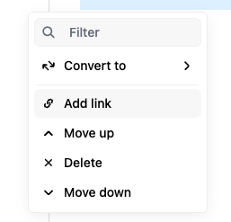
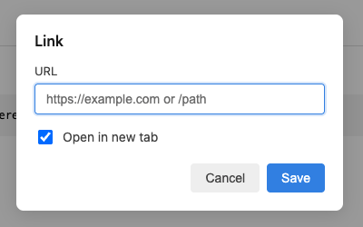

# Editor.js Link Block Tune

A [Block Tune](https://editorjs.io/block-tunes-api/) for [Editor.js](https://editor.js.org/) that lets you associate a link with any block. When a link is set, the block content is wrapped in an anchor so the whole block becomes clickable.

#### Toolbox



#### Modal



## Requirements

- Editor.js **v2.22.0** or higher

## Installation

### NPM

```bash
npm install editorjs-link-blocktune

yarn add editorjs-link-blocktune
```

## Usage

Register the tune in your Editor.js config and attach it to tools via `tunes`:

```javascript
import EditorJS from '@editorjs/editorjs';
import LinkBlockTune from 'editorjs-link-blocktune';

const editor = new EditorJS({
  tools: {
    paragraph: {
      class: Paragraph,
      inlineToolbar: true,
      tunes: ['linkTune'],
    },
    header: {
      class: Header,
      inlineToolbar: true,
      tunes: ['linkTune'],
    },
    linkTune: {
      class: LinkBlockTune,
      config: {
        label: 'Add link',
      },
    },
  },
});
```

## Config

| Field         | Type   | Description                                     |
| ------------- | ------ | ----------------------------------------------- |
| label         | string | Tooltip / default “Add link” text               |
| labelAddLink  | string | Label when no link is set (default: "Add link") |
| labelEditLink | string | Label when link is set (default: "Edit link")   |
| icon          | string | Optional. Override icon (SVG string etc)        |

## Data

The tune saves with the block:

- `url` (string) – The URL associated with the block. Empty string when no link is set.
- `openInNewTab` (boolean) – Whether the link should open in a new tab (`target="_blank"`). Default `true`. Your front-end can use this when rendering the link.

```json
"tunes": {
  "linkTune": {
    "url": "https://github.com/aacoelho/editorjs-link-blocktune",
    "openInNewTab": true
  }
}
```

## Development

```bash
npm install
npm run build        # production build → dist/bundle.js
npm run build:dev   # development build with watch
```

Open `example/index.html` in a browser to try the tune (after `npm run build`).

## License

MIT
